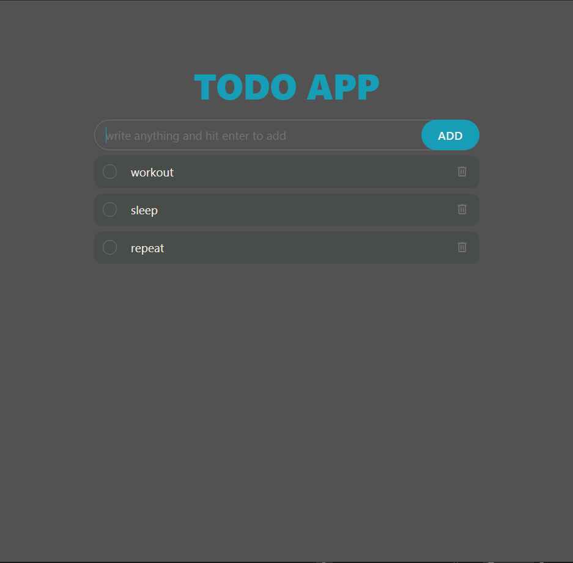

# Todo App (HTML, CSS, JavaScript)

A lightweight, responsive Todo app built with vanilla **HTML**, **CSS**, and **JavaScript**. Create tasks, mark them complete, and keep your day organized with a clean UI and simple interactions—no frameworks required.

## Live Demo
- Demo: [Add your link here]
- Repo: [Add your repo link here]

## Preview

> Add a screenshot to `assets/screenshot.png` (or update the path above).

---

## Features
- Add new tasks
- Mark tasks as complete / incomplete
- Delete tasks
- Clear completed tasks *(if you added this)*
- Responsive layout for desktop + mobile
- Data persistence using **LocalStorage** *(if you added this)*

---

## Tech Stack
- **HTML5** – structure
- **CSS3** – layout, responsive styling
- **JavaScript (ES6+)** – logic and DOM manipulation

---

## How It Works
- Tasks are rendered dynamically in the DOM.
- Each task has a completion state (completed / active).
- User actions (add, toggle, delete) update the UI immediately.
- *(If applicable)* Tasks are saved to **LocalStorage** so they remain after refresh.

---

## Project Structure
```text
todo-app/
├─ index.html
├─ style.css
├─ script.js
└─ assets/
   └─ screenshot.png
